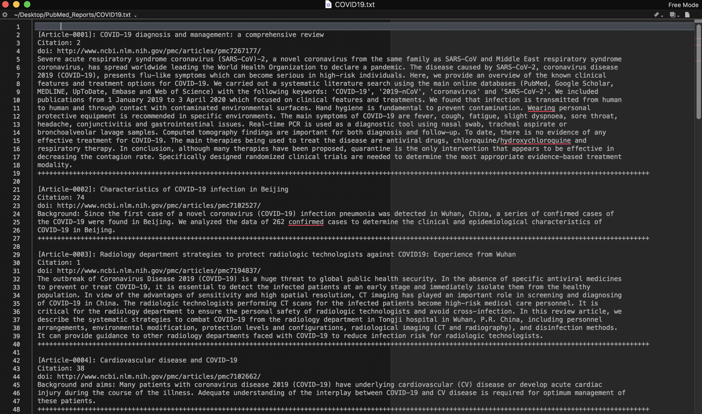
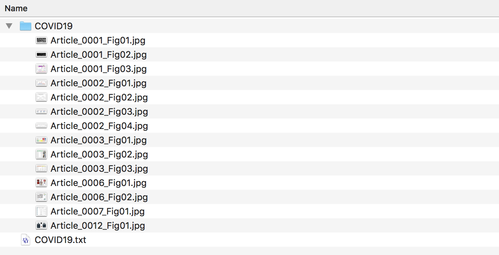

# <font size=6><br>_**pmExt.py</br></font> <font size=2>(Pubmed Article Search and Download python script)**_</font>

## <font color=white>_Feature_</font>
<font size=4>Let's <font color=grean><b>_Search_</b></font> and <font color=yellow><b>_Download_</b> </font>Articles with <font color=red><b>_Keywords_ </b></font>!!</font>

## Description
+ Searching articles using Pubmed Engine
+ The script is very simple to use
+ Outputs are "_Summary of Articles_" and "_Article Figures_"
+ The script supports <b>_python3_</b> and <b>_Chrome_</b>
+ <font color=yellow>The script searches images from <b> _all scrolled pages_ </b></font>
+ _Progressbar_ is supporting in this version

## Install requirements
### &nbsp;&nbsp;&nbsp;_ChromeDriver_
&nbsp;&nbsp;&nbsp;&nbsp;You need to install [ChromeDriver](https://chromedriver.chromium.org/) to use this script.<br>
&nbsp;&nbsp;&nbsp;&nbsp;The installation instruction can be found [here](http://jonathansoma.com/lede/foundations-2018/classes/selenium/selenium-windows-install/).

### &nbsp;&nbsp;&nbsp;_Modules_
&nbsp;&nbsp;&nbsp;&nbsp;
```pip setup.py install```

### &nbsp;&nbsp;&nbsp;_Before using this script_
##### &nbsp;&nbsp;&nbsp;You should input your own _'ChromeDriver'_ path in the following line of pmExt.py
&nbsp;&nbsp;&nbsp;
&nbsp;&nbsp;&nbsp;&nbsp; For Windows,
```pathx = "your/chromeDriver/path/chromedriver.exe"```
<br>
&nbsp;&nbsp;&nbsp;&nbsp;&nbsp;&nbsp;&nbsp;&nbsp; For MacOS,
&nbsp;&nbsp;&nbsp;```pathx = "your/chromeDriver/path/chromedriver"```


## Usage
+ <b>Run in Terminal</b>
```
python pmExt.py
```
+ <b> Just type _keywords_ and _number of articles_</b>


+ <b>Tips</b>
```
(1) Can use multiple keywords with commas : A,B,C
(2) Use this script in a stable internet environment
```


+ <b>Help</b>
```
python pmExt.py --help
```

## Outputs
* <font size=4>_Summary of Articles (.txt)_</font>


* <font size=4>_Article figures_</font>


## Version history
+ Version 0.1: the script release (2020.08.01)

## _Contact for Feedback and Bug Reports_
_Uksu, Choi (qtwing@naver.com)_
